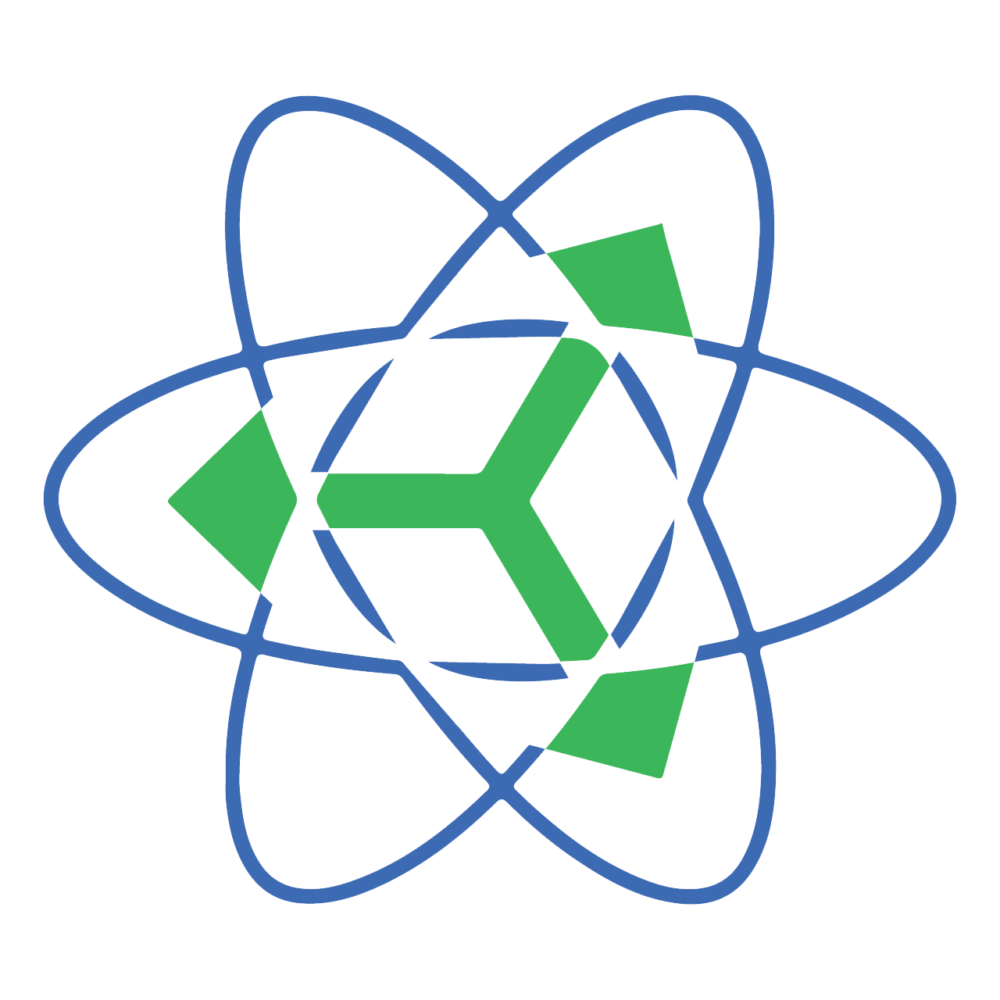

<div align="center">



# ReactUnity

**Build Unity3D user interfaces with React, CSS and flexbox.**

[](https://openupm.com/packages/com.reactunity.core/)
[](https://www.npmjs.com/package/@reactunity/renderer)
[](https://github.com/ReactUnity/core/actions/workflows/unity-tests.yml)
[](https://discord.gg/UY2EFW5ZKG)

[Documentation](https://reactunity.github.io) &nbsp;·&nbsp; [Sample project](full-sample) &nbsp;·&nbsp; [Discord](https://discord.gg/UY2EFW5ZKG)

</div>

ReactUnity renders React components directly into Unity — UGUI, UIToolkit and Editor
windows — with no DOM and no embedded browser. You keep the React ecosystem
(TypeScript, Redux, react-router, i18next and the rest) and lay things out with a
subset of CSS on top of Yoga flexbox.

## Requirements

| | |
| --- | --- |
| Unity | 2021.3 or newer. CI covers 2021.3, 2022.3, 2023.2, 6000.0 and 6000.1. |
| Node | 20 or newer. Used only while developing — it is not needed at runtime or in a built player. |
| TextMeshPro | v3 |

## Getting started

Add the Unity packages via [OpenUPM](https://openupm.com/packages/com.reactunity.core/):

```bash
npx openupm-cli add com.reactunity.core com.reactunity.quickjs
```

Or add the git URL through Unity's package manager:

```
https://github.com/ReactUnity/core.git#latest
```

Then, in your Unity project:

1. Create a canvas and add a `ReactRendererUGUI` component to it.
2. Run `npx @reactunity/create@latest` in the project root to scaffold the React side.
3. `npm install` and `npm start` from the generated React project.
4. Press play in Unity.

The [documentation site](https://reactunity.github.io) covers styling, the component
reference and the scripting engines in depth.

## Packages

This repository publishes to two registries. Everything shares a single version number.

**Unity packages** — installed into a Unity project, published to OpenUPM and as git tags:

| Package | |
| --- | --- |
| [`com.reactunity.core`](unity/core) | The renderer, styling engine and Unity-side runtime. |
| [`com.reactunity.quickjs`](unity/quickjs) | QuickJS scripting engine. Recommended. |
| [`com.reactunity.jint`](unity/jint) | Jint scripting engine. Pure C#, slower, no native binary. |
| [`com.reactunity.clearscript`](unity/clearscript) | ClearScript (V8) scripting engine. |

Pick exactly one scripting engine so your project pulls in only one native binary.

**npm packages** — installed into the React app that drives the UI:

| Package | |
| --- | --- |
| [`@reactunity/renderer`](packages/renderer) | The `react-reconciler` host config and generated type models. |
| [`@reactunity/scripts`](packages/scripts) | Build and dev-server toolchain (`react-unity-scripts`). |
| [`@reactunity/material`](packages/material) | Material Design components. |
| [`@reactunity/create`](packages/create) | Project scaffolder (`npx @reactunity/create`). |

## Repository layout

ReactUnity used to be spread across a dozen repositories. They were merged here with
their histories intact, so `git log` reaches back through every one of them.

```
unity/          Unity (UPM) packages — core plus the three scripting engines
packages/       npm packages
docs/           the documentation site, deployed to reactunity.github.io
full-sample/    a complete Unity project using ReactUnity
samples/        smaller standalone samples
tests/          the Unity project that runs the C# test suite
scripts/        release tooling
media/          logos and brand assets
```

Unity packages are published to an orphan branch per package whose tree root *is* the
package, which is why `core.git#latest` keeps resolving even though the sources now
live under `unity/core/`.

## Development

Working on the repository itself needs Node 26 (pinned in `.node-version`) and pnpm 11
— the exact version comes from the `packageManager` field. The floors in
[Requirements](#requirements) are for *consuming* ReactUnity, not for building it.

```bash
pnpm install
pnpm build
pnpm check
```

`build` compiles the npm packages in dependency order; `check` runs
[Biome](https://biomejs.dev) over the repository, which is what CI enforces. Work on a
single package with a filter:

```bash
pnpm --filter @reactunity/renderer build
```

To run a React app against a live Unity editor, start its dev server and press play —
Unity connects to it and hot-reloads:

```bash
pnpm --filter reactunity-sample start
```

The C# tests have no local CLI entry point: open `tests/` in Unity and use the Test
Runner, or let the `Unity Tests` workflow run the full matrix. `tests/Packages/manifest.json`
already points at the local `unity/*` packages, so no wiring is needed.

[CLAUDE.md](CLAUDE.md) documents the architecture and the toolchain decisions in more
detail, and the workflow files under [.github/workflows](.github/workflows) explain why
CI is shaped the way it is.

## Contributing

Issues, questions and pull requests are all welcome. Documentation coverage is the
weakest part of the project, so corrections there are especially useful. For anything
open-ended, the [Discord server](https://discord.gg/UY2EFW5ZKG) is usually faster than
an issue.

## License

MIT — see [LICENSE](LICENSE). The documentation under `docs/` is
[CC-BY-4.0](docs/LICENSE.md). Thanks to everyone listed in
[acknowledgements](.github/acknowledgements.md).
